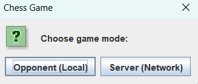
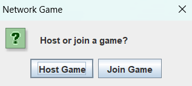
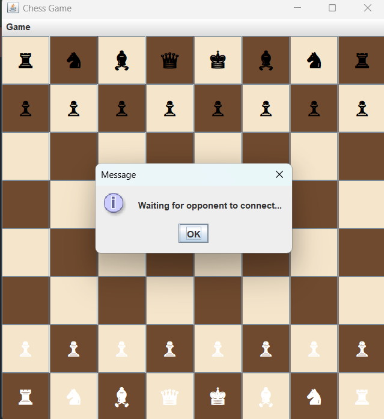
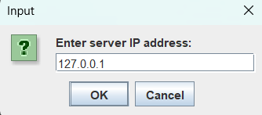
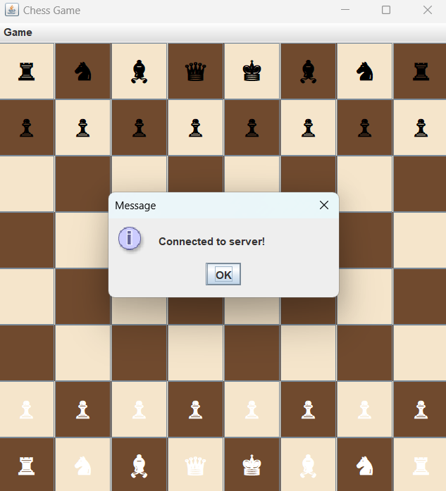
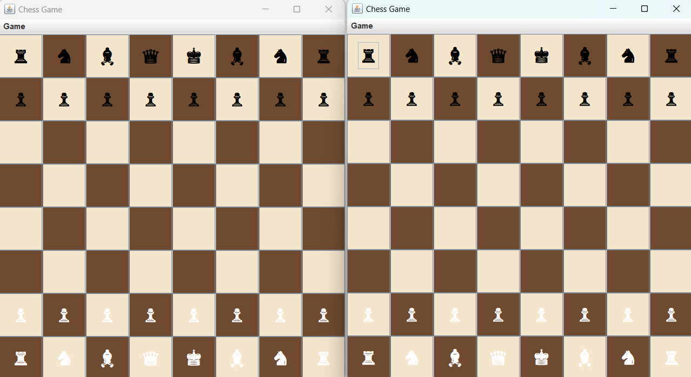

# Chess Game Project

## Description

This is a network-enabled Chess game built in Java. The game supports both local (two players on the same machine) and network modes (one player hosting and another joining). The project implements standard chess game logic—including legal move validation, check, checkmate, and restart/termination options—using a custom messaging protocol to communicate game events between players.

## How To Play
1. **First, each player runs the game and both of them choose `Server(Network)`.**
   - .
2. **One of them Host the game.**
   - .
   - .
3. **The other Join the Game and write the ip address or `127.0.0.1` if you play in the same device.**
   - .
4. **The connection has established.**
   - 
5. **Enjoy the game.**
  - 

## Demo
[Watch the Demo Video](https://github.com/user-attachments/assets/092ece4d-ced4-4e20-963b-cce855211fcf)

## Features

- **Chess Game Logic:**  
  Implements chess rules with legal move checking, detection of check and checkmate, and game state management.
  
- **Local and Network Play:**  
  - **Local Mode:** Two players can play on the same machine.
  - **Network Mode:** One player hosts (server) and another joins (client) via Java sockets.
  
- **Network Messaging Protocol:**  
  Uses a serializable `GameMessage` class to send moves, game over events, restart requests, and termination messages between players.
  
- **Graphical User Interface:**  
  Built with Java Swing, the GUI displays the chessboard, pieces, and highlights legal moves.
  
- **Game Over Handling:**  
  At the end of a game, the winner is notified and prompted to restart. If a player chooses not to continue, a termination message is sent to the opponent before the game exits.

## Technologies & Tools

- **Programming Language:** Java
- **GUI Library:** Swing
- **Networking:** Java Sockets
## How to Run

### Prerequisites

- Java JDK 8 or higher installed on your machine.
- (Optional) An IDE for Java development (e.g., IntelliJ IDEA, Eclipse, or NetBeans).
- Download or clone the project repository.

### Running from an IDE

1.  **Open the Project:**
    
    -   Launch your preferred Java IDE.
    -   Import the project as a new Java project.
2.  **Run the Main Class:**
    
    -   Locate the `ChessGUI.java` file (which contains the `main` method).
    -   Run the `ChessGUI` class directly from your IDE.
    -   The game window will open and prompt you to choose the game mode.

## How to Use

1.  **Game Mode Selection:**
    
    -   **Local Mode:** Select "Opponent (Local)" to play a two-player game on the same machine.
    -   **Network Mode:** Select "Server (Network)" to play over a local network.
        -   You will be prompted to either **Host** a game or **Join** a game.
        -   If hosting, your game will wait for an opponent to connect.
        -   If joining, enter the host’s IP address to connect.
2.  **Gameplay:**
    
    -   Players click on a piece to select it and then click on the destination square to move.
    -   Legal moves are highlighted.
    -   In network mode, moves are synchronized between the host and the client.
3.  **Game Over & Restart:**
    
    -   When checkmate is detected, both players are notified.
    -   The winning side is prompted to decide whether to play again.
    -   If a player chooses "No", a termination message is sent to the opponent. Both sides are then notified before the program exits.

